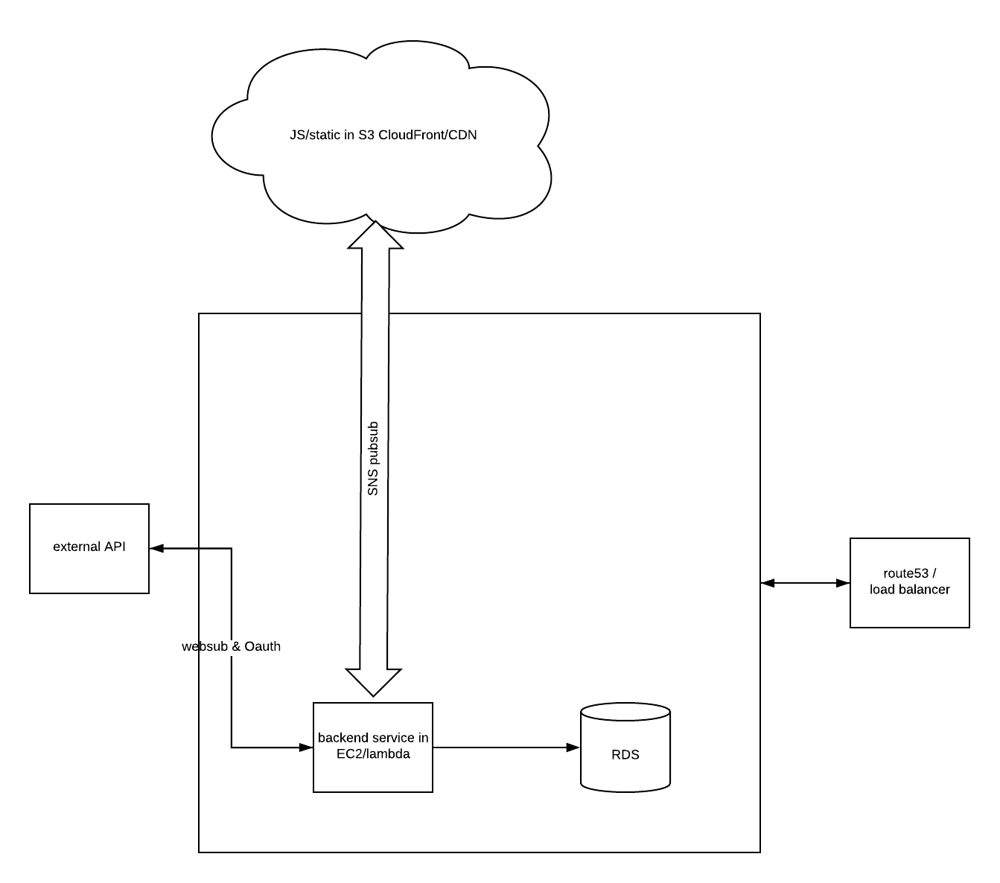

- demo: https://streamlabs-frontend.herokuapp.com/ (running under development server)
- source: https://github.com/khan08/StreamerEventViewer/
Around 4 hours are spent on this project. Due to the time constraint, this web app has lots of room to improve. Looking back it might be better to use a MVC framework like Laravel or Django for a quick prototypeThis web app is developed in flask with socket.IO and reactJS. 

## Test Event Listener
- In sign in page, type in your twich user name, or a twich account you have access to. Click log in.
- In the streamer page, check the ugly event list on the right
- Go to twitch, follow any streamer
- Go back to streamer page, see the new follow is added to the top of the event list

## Basic Flow
- User provide a streamer name, and authenticate through Twitch
- Redirected auth page calls backend endpoint to
  - retrieve provided streamer last 10 events
  - subscribe to streamer event
- User redirected to the second page
  - add new room (streamer's id) in socket for the streamer if it doesn't exist, join the created room
  - in reactJS listen to the streamer specific socket
- Webhook callbacks will trigger a broadcast from flask to all subscriber of that streamer's socket room (socket.io)
  
## Assumptions
- user can only specify one favroite streamer
- subscribe to user follow other event (https://api.twitch.tv/helix/users/follows?first=1&from_id=<following-id>)

## Limitations
. Below are the main todos/limitations:
- No backend auth system and token verifycaiton, the flask socket.io backend is only used for event listening. Once oAuth redirects, the app naively assumes a url with access token hash means authenticated. No token server storage and verifications.
- To the above point, localstorage stores a dummy session to immitate server authentication
- No oAuth state param check, also because of the lack of an auth. Vulnerable to CSRF attacks
- Use redirect state param for passing user favoirte streamer information, quick hacky solution
- No exception handling. (e.g. if user provided streamer name does not exist, a debug page will show up from dev server)
- Flask backend does not use app access token, rate limit will be low
- No token refreshing

## Questions
### How would you deploy the above on AWS? (ideally a rough architecture diagram will help)

Flask in ec2, and reactJS in CDN. Since this is not streaming media, an SNS pubsub system could be better suited for subscribing events. RDS is used for a backend auth system, and storing user info.

## Where do you see bottlenecks in your proposed architecture and how would you approach scaling this app starting from 100 reqs/day to 900MM reqs/day over 6 months?

The bottleneck is the web socket. Currently a single websocket is serving all the clients, distinguishing streamer by rooms. Since sreaming media is not really required, using a pubsub queue system as shown above is better for scalability. It would further decouple flask and reactJS server 

For a huge growth from 100reqs/day to 900MM reqs/day:
- CDN should be able to handle the performance of loading static files (reactjs) 
- EC2 autocaling groups is worth to investigate, it might be overkill and too much to maintain, depending on the votality of user requests size. 
- Levraging RDS read replicas could be helpful depending on the number of user.
- Cache layer: CDN handles the page request cache. Adding another cache layer for the web service and db can improve performance. 

All of the above changes in theory would not cause downtime.
=======

